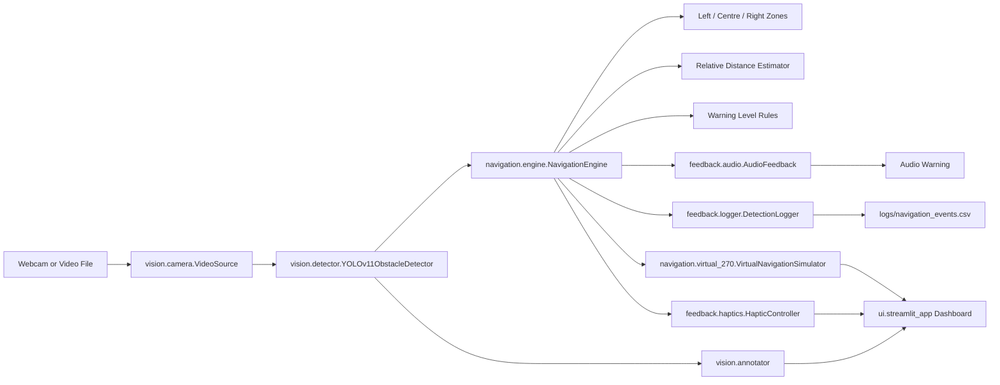
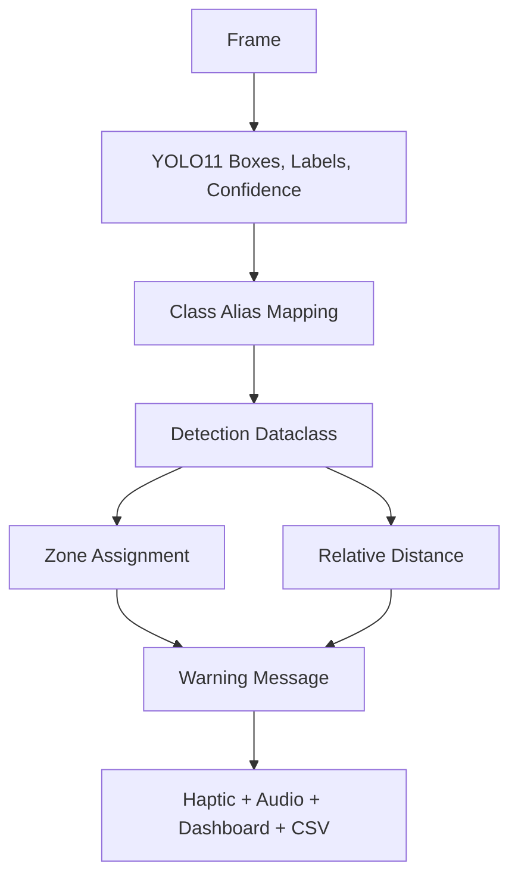
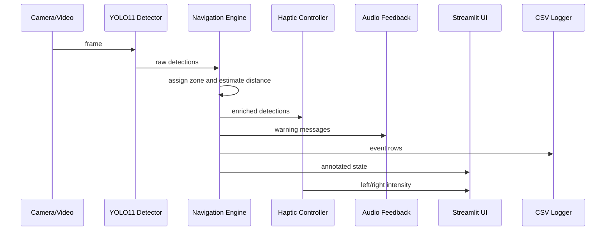
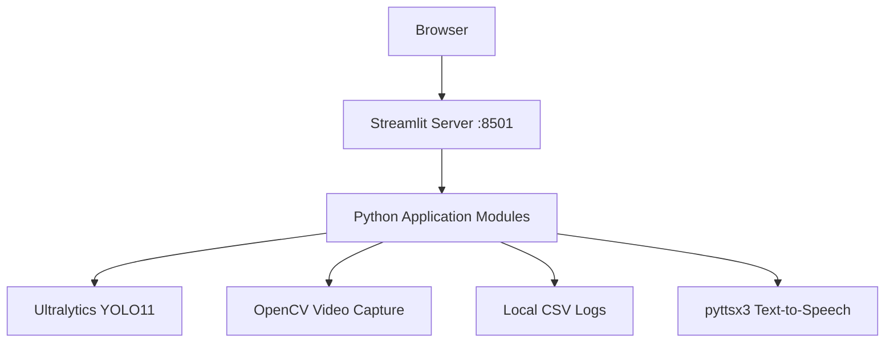

# Architecture Diagrams

## System Architecture

```mermaid
flowchart LR
    Input["Webcam or Video File"] --> Capture["vision.camera.VideoSource"]
    Capture --> Detector["vision.detector.YOLOv11ObstacleDetector"]
    Detector --> Nav["navigation.engine.NavigationEngine"]
    Nav --> Zones["Left / Centre / Right Zones"]
    Nav --> Distance["Relative Distance Estimator"]
    Nav --> Risk["Warning Level Rules"]
    Nav --> Haptic["feedback.haptics.HapticController"]
    Nav --> Audio["feedback.audio.AudioFeedback"]
    Nav --> Logger["feedback.logger.DetectionLogger"]
    Nav --> Virtual["navigation.virtual_270.VirtualNavigationSimulator"]
    Detector --> Annotator["vision.annotator"]
    Annotator --> UI["ui.streamlit_app Dashboard"]
    Haptic --> UI
    Audio --> User["Audio Warning"]
    Logger --> CSV["logs/navigation_events.csv"]
    Virtual --> UI
```

## Data Flow

```mermaid
flowchart TD
    Frame["Frame"] --> Boxes["YOLO11 Boxes, Labels, Confidence"]
    Boxes --> Canonical["Class Alias Mapping"]
    Canonical --> Enriched["Detection Dataclass"]
    Enriched --> Zone["Zone Assignment"]
    Enriched --> Depth["Relative Distance"]
    Zone --> Warning["Warning Message"]
    Depth --> Warning
    Warning --> Feedback["Haptic + Audio + Dashboard + CSV"]
```

## Runtime Sequence

```mermaid
sequenceDiagram
    participant Camera as Camera/Video
    participant Detector as YOLO11 Detector
    participant Engine as Navigation Engine
    participant Haptic as Haptic Controller
    participant Audio as Audio Feedback
    participant UI as Streamlit UI
    participant Log as CSV Logger

    Camera->>Detector: frame
    Detector->>Engine: raw detections
    Engine->>Engine: assign zone and estimate distance
    Engine->>Haptic: enriched detections
    Engine->>Audio: warning messages
    Engine->>Log: event rows
    Engine->>UI: annotated state
    Haptic->>UI: left/right intensity
```

## Deployment View

```mermaid
flowchart TB
    Browser["Browser"] --> Streamlit["Streamlit Server :8501"]
    Streamlit --> Python["Python Application Modules"]
    Python --> Ultralytics["Ultralytics YOLO11"]
    Python --> OpenCV["OpenCV Video Capture"]
    Python --> CSV["Local CSV Logs"]
    Python --> TTS["pyttsx3 Text-to-Speech"]
```
