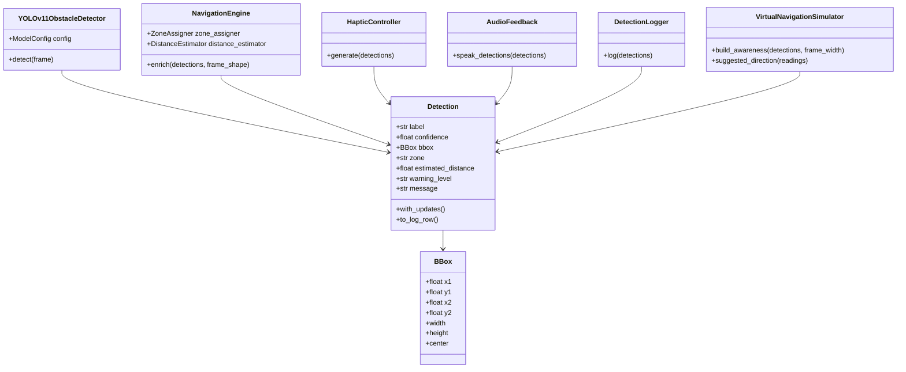
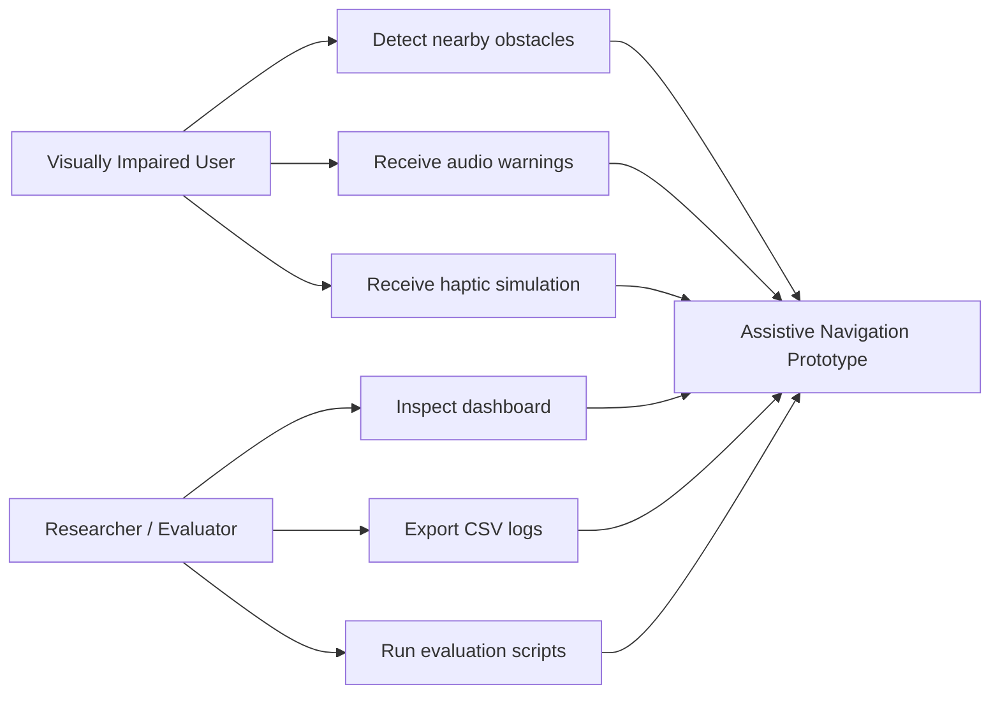
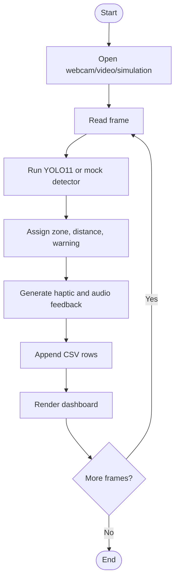

# UML Diagrams

## Class Diagram

```mermaid
classDiagram
    class Detection {
        +str label
        +float confidence
        +BBox bbox
        +str zone
        +float estimated_distance
        +str warning_level
        +str message
        +with_updates()
        +to_log_row()
    }

    class BBox {
        +float x1
        +float y1
        +float x2
        +float y2
        +width
        +height
        +center
    }

    class YOLOv11ObstacleDetector {
        +ModelConfig config
        +detect(frame)
    }

    class NavigationEngine {
        +ZoneAssigner zone_assigner
        +DistanceEstimator distance_estimator
        +enrich(detections, frame_shape)
    }

    class HapticController {
        +generate(detections)
    }

    class AudioFeedback {
        +speak_detections(detections)
    }

    class DetectionLogger {
        +log(detections)
    }

    class VirtualNavigationSimulator {
        +build_awareness(detections, frame_width)
        +suggested_direction(readings)
    }

    Detection --> BBox
    YOLOv11ObstacleDetector --> Detection
    NavigationEngine --> Detection
    HapticController --> Detection
    AudioFeedback --> Detection
    DetectionLogger --> Detection
    VirtualNavigationSimulator --> Detection
```

## Use Case Diagram

```mermaid
flowchart LR
    User["Visually Impaired User"]
    Researcher["Researcher / Evaluator"]
    System["Assistive Navigation Prototype"]

    User --> Detect["Detect nearby obstacles"]
    User --> Audio["Receive audio warnings"]
    User --> Haptic["Receive haptic simulation"]
    Researcher --> Dashboard["Inspect dashboard"]
    Researcher --> Logs["Export CSV logs"]
    Researcher --> Eval["Run evaluation scripts"]

    Detect --> System
    Audio --> System
    Haptic --> System
    Dashboard --> System
    Logs --> System
    Eval --> System
```

## Activity Diagram

```mermaid
flowchart TD
    Start([Start]) --> Source["Open webcam/video/simulation"]
    Source --> Frame["Read frame"]
    Frame --> Detect["Run YOLO11 or mock detector"]
    Detect --> Enrich["Assign zone, distance, warning"]
    Enrich --> Feedback["Generate haptic and audio feedback"]
    Feedback --> Log["Append CSV rows"]
    Log --> Render["Render dashboard"]
    Render --> Continue{"More frames?"}
    Continue -- Yes --> Frame
    Continue -- No --> End([End])
```
